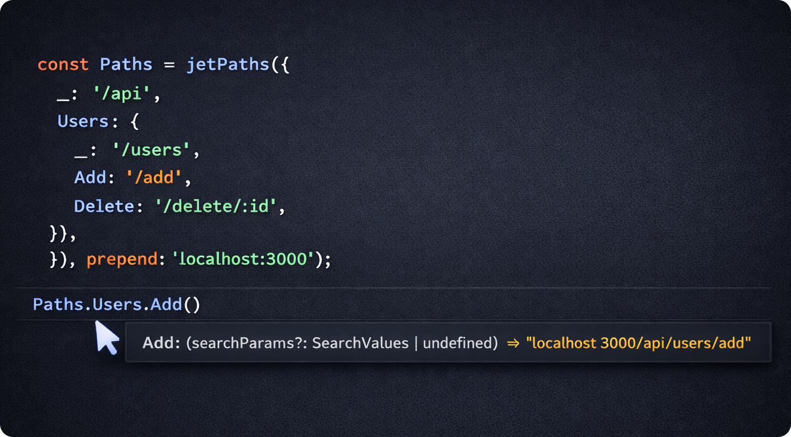
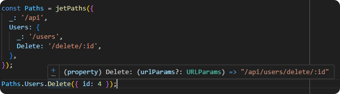

# jet-paths ✈️

[](https://www.npmjs.com/package/jet-paths)
[](https://www.npmjs.com/package/jet-paths)
[](https://www.typescriptlang.org/)
[](https://bundlephobia.com/package/jet-paths)
[](LICENSE)

> A type-safe utility for defining, composing, and formatting URL paths using nested objects.

Recursively formats an object of URLs so that full paths are set up automatically, allowing you to insert path-params and query-params easily and consistently.

At a glance:

```ts
const Paths = jetPaths({
  _: '/api',
  Users: {
    _: '/users',
    Get: '/all',
    One: '/:id',
  },
});

Paths.Users.Get; // "/api/users/all"
Paths.Users.One(5); // "/api/users/5"
Paths.Users._; // "/api/users"
```

<br/><b>\*\*\*</b><br/>

## 🤔 Why jet-paths?

- Automatically sets up full URLs using nested objects, avoiding repeated prefixes.
- URLs with parameters are automatically converted into functions for easy value insertion.
- Optional regular expression validation ensures URLs conform to a specific format.
- **TypeScript-first** and fully type-safe.

<p align="center">
  
</p>

- Functions are fully type-safe too ;)

<p align="center">
  
</p>

---

### Keep your routes organized

With **jet-paths**, you can keep all routes for your entire application neatly formatted into a single object—without repetitive prefixes or custom wrapper functions to insert URL parameters.

Traditionally, routes are often defined like the snippet below. As applications grow, this approach becomes repetitive and error-prone:

```ts
const BASE = '/api';
const BASE_USERS = `${BASE}/users`;

{
  Users: {
    Get: `${BASE_USERS}/all`,
    One: (id: string | number) => `${BASE_USERS}/${id}`,
  },
  // ...more routes
}
```

---

### Insert path paramters

Mark URL parameters using `/:`. Any URL containing a parameter is automatically formatted as a function—both at runtime and compile time.

```ts
const Paths = jetPaths({
  _: '/api',
  Users: {
    _: '/users',
    Get: '/all',
    One: '/:id',
    FooBar: '/foo/:name/bar/:id',
  },
});

Paths.Users.FooBar({ id: 5, name: 'sean' });
// "/api/users/foo/sean/bar/5"
```

<br/><b>\*\*\*</b><br/>

## ⚡ Quick Start

### Installation

```bash
npm install jet-paths
```

### Example

```ts
import jetPaths from 'jet-paths';

const Paths = jetPaths(
  {
    _: '/api',
    Users: {
      _: '/users',
      Get: '/all',
      Add: '/add',
      Update: '/update',
      Delete: '/delete/:id',
    },
    Posts: {
      _: '/posts',
      Get: '/all',
      Add: '/add',
      Update: '/update',
      Delete: '/delete/:id',
      Private: {
        _: '/private',
        Get: '/all',
        Delete: '/delete/:foo/bar/:id',
      },
    },
  },
  { prepend: 'localhost:3000' },
);
```

The object above is formatted into fully qualified, type-safe routes:

```ts
Paths.Users._; // "/localhost:3000/api/users"
Paths.Users.Delete({ id: 1 });
```

<br/><b>\*\*\*</b><br/>

## 📥 Passing arguments to URL functions

You may pass an object or no arguments at all when calling a URL function.

Key behaviors to note:

- If an object is passed, its keys must match the parameter names in the URL.
- When `strictKeyNames` is `true` (default), extra or missing keys will throw an error.
- Calling the function with no arguments returns the unformatted URL.

<br/><b>\*\*\*</b><br/>

## ⚙️ Options

#### `prepend` (`string` | `undefined`, default: `undefined`)

Prepends a string to the beginning of every route. While this can also be achieved via the root `_` key, passing a non-constant value here will cause type information to be lost.

---

#### `strictKeyNames` (`boolean`, default: `true`)

When enabled, object keys passed to a URL function must exactly match the URL parameter names—no more, no fewer. Any mismatch will throw an error.

```ts
Paths.Users.FooBar({ id: 5, name: 'sean', age: 4 }); // Error: too many keys
Paths.Users.FooBar({ name: 'sean' }); // Error: missing key "id"
```

---

#### `.insertUrlParams`

If you need to insert URL parameters outside of a `jetPaths` object, you can import `insertUrlParams` directly. For efficiency, it returns a formatter function bound to the URL.

```ts
import { insertUrlParams } from 'jet-paths';

const formatPath = insertUrlParams('/foo/:name/bar/:id', {
  strictKeyNames: false,
});

formatPath({ id: 5, name: 'sean' }); // "/foo/sean/bar/5"
```

<br/><b>\*\*\*</b><br/>

## 📄 License

MIT © [seanpmaxwell1](LICENSE)
<br/>

Happy web deving! 🚀
